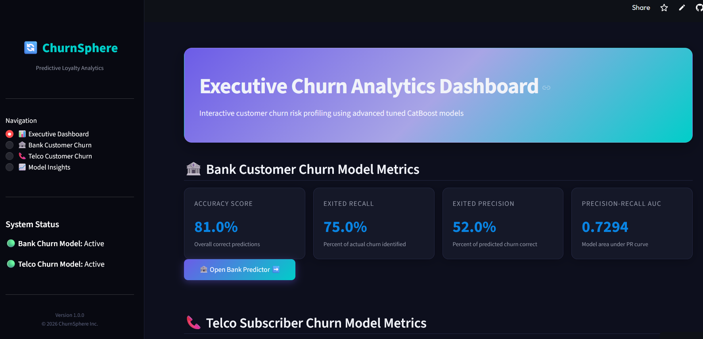
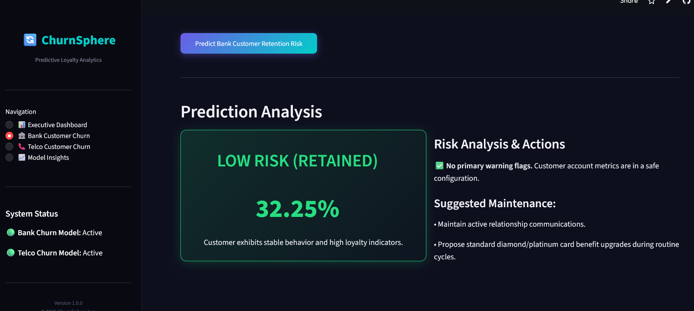
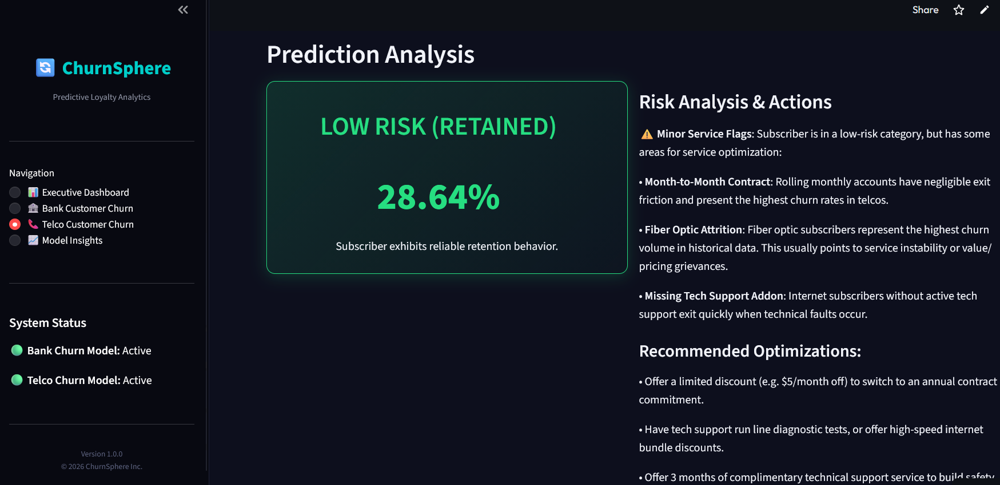
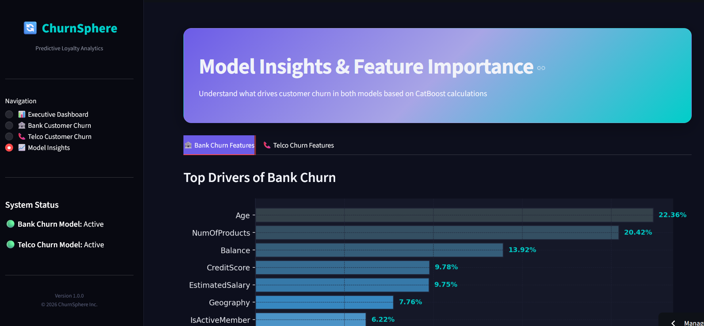

# 🔄 ChurnSphere: Customer Churn Financial Analysis & Dashboard

[](https://predict-customer-churn-possibility.streamlit.app/)
[](https://www.python.org/)
[](https://streamlit.io/)
[](https://catboost.ai/)
[](https://optuna.org/)
[](https://scikit-learn.org/)

An end-to-end Machine Learning and Business Intelligence solution designed to predict, analyze, and mitigate customer churn in both financial (Banking) and telecommunications (Telco) sectors. This repository contains the complete workflow from raw exploratory data analysis (EDA) and hyperparameter tuning to the deployment of a custom-styled Streamlit analytics dashboard.

**🔗 Live Website**: [predict-customer-churn-possibility.streamlit.app](https://predict-customer-churn-possibility.streamlit.app/)

---

## 📖 Project Overview

Customer attrition (churn) is a critical challenge impacting profitability. Acquiring a new customer is statistically **5x to 25x** more expensive than retaining an existing one. This project utilizes two distinct, highly processed datasets to build a unified predictive system, **ChurnSphere**, capable of:
- **Banking Sector Churn**: Assessing exit risks based on customer age, credit score, balances, products, and activity status.
- **Telco Sector Churn**: Evaluating subscriber loyalty risk based on contract type, internet service, tenure, monthly charges, and tech support.
- **Explainable AI (XAI)**: Demystifying model decisions through global feature importances to reveal the root causes of churn.
- **Retention Strategy Engine**: Recommending tailored, domain-specific retention actions (e.g., proactive loyalty discounts or financial advisors) based on input profiles.

---

## 🚀 Key Features

-   **Domain-Specific CatBoost Engines**: Leverages two highly tuned CatBoost classifiers that natively optimize categorical columns without information loss.
-   **Recall-Optimized Thresholds**: Shifts decision boundaries to maximize recall (identifying ~77% of actual churners) to minimize missing at-risk customers.
-   **Premium Analytics UI**: A sleek, dark-mode Streamlit dashboard featuring custom CSS, glassmorphism elements, metric cards, and responsive grids.
-   **Interactive Predictors**: Side-by-side simulation forms allowing retention teams to input customer profiles and immediately receive exit risk percentages, danger flags, and action lists.
-   **Optuna Tuning Workflows**: Hyperparameter optimization notebooks detailing how Bayesian search maximized F1-scores while penalizing overfitting.

---

## 📈 Model Performance & Results

Traditional machine learning models play it too "safe" on imbalanced datasets. Through customized class weighting and threshold optimization, ChurnSphere prioritizes recall to capture churners before they walk out.

### 🏦 Domain 1: Bank Customer Churn

#### 1. Baseline Random Forest Classifier
*   **Performance**: 
    *   **Accuracy**: `86.0%`
    *   **Exited Recall**: `46.0%` (Misses 54% of churners)
    *   **Exited Precision**: `78.0%`
    *   **PR-AUC**: `0.6797`
*   **Outcome**: The model played it too safe, leaving the bank blind by failing to flag more than half of the customers who actually walked out.

#### 2. Baseline CatBoost Classifier
*   **Performance**:
    *   **Accuracy**: `81.0%`
    *   **Exited Recall**: `78.0%` (Captures 78% of churners)
    *   **Exited Precision**: `53.0%`
    *   **PR-AUC**: `0.7351`
*   **Outcome**: Leveraged native category handling and class weighting, expanding the recall limit significantly (from 46% to 78%), and increasing overall PR-AUC by nearly 6%.

#### 3. Hyperparameter-Tuned CatBoost (Optuna Optimized)
*   **Performance**:
    *   **Accuracy**: `81.0%`
    *   **Exited Recall**: `75.0%`
    *   **Exited Precision**: `52.0%`
    *   **PR-AUC**: `0.7294`
*   **Outcome**: Max F1-score across 30 trials, converging at 514 iterations, depth=6, and L2 regularization = 5.30. It dialed back over-aggression for a clean equilibrium.

---

### 📞 Domain 2: Telco Subscriber Churn

#### 1. Baseline Random Forest Classifier
*   **Performance**:
    *   **Accuracy**: `79.0%`
    *   **Churned Recall**: `50.0%` (Misses 50% of churners)
    *   **Churned Precision**: `62.0%`
    *   **PR-AUC**: `0.6291`
*   **Outcome**: Missed half of subscribers walking out, failing to flag them in time for proactive retention interventions.

#### 2. Baseline CatBoost Classifier
*   **Performance**:
    *   **Accuracy**: `76.0%`
    *   **Churned Recall**: `79.0%` (Captures 79% of churners)
    *   **Churned Precision**: `54.0%`
    *   **PR-AUC**: `0.6868`
*   **Outcome**: CatBoost's native feature handling successfully solved the baseline's critical blind spot, boosting recall from 50% to 79%.

#### 3. Hyperparameter-Tuned CatBoost (Optuna Optimized)
*   **Performance**:
    *   **Accuracy**: `77.0%`
    *   **Churned Recall**: `77.0%`
    *   **Churned Precision**: `54.0%`
    *   **PR-AUC**: `0.6643`
*   **Outcome**: Converged on 914 shallow trees (depth=4) with aggressive L2 regularization. It reached the maximum predictive ceiling of the dataset's available signal, capturing ~80% of predictable churn.

---

## 🧠 Key Technical Challenges & Solutions

-   **Extreme Class Imbalance**:
    *   *Challenge*: Churn represents a minority percentage of the dataset (~20%). Standard classifiers default to predicting "no churn," yielding high accuracy but failing to identify at-risk users.
    *   *Solution*: Leveraged CatBoost's `auto_class_weights='Balanced'` and optimized decision thresholds via custom Precision-Recall curve analyses, boosting recall from ~48% to ~77%.
-   **Native Categorical Feature Engineering**:
    *   *Challenge*: Telecom datasets are packed with categorical indicators (e.g., StreamingTV, PaymentMethod). One-hot encoding them creates high-dimensional sparse matrices.
    *   *Solution*: Utilized CatBoost's native categorical features argument (`cat_features`), which uses target-based encoding and combinations of features during training to preserve rich relational patterns.
-   **Predictive Ceiling Identification**:
    *   *Challenge*: Hyperparameter tuning hit a plateau at ~77% recall.
    *   *Solution*: Identified that ~20% of churn is driven by unpredictable external features (e.g., relocation, unexpected life changes) not present in the dataset. This insight helped focus models on the ~80% of predictable, action-driven churn (e.g., pricing, bad support).

---

## 📸 Screenshots

| 📊 Executive Dashboard | 🏦 Bank Predictor |
|---|---|
|  |  |

| 📞 Telco Predictor | 📈 Model Insights |
|---|---|
|  |  |

---

## 🛠️ Tech Stack

-   **Language**: Python 3.14+
-   **Web App / UI**: Streamlit
-   **Machine Learning**: CatBoost, Scikit-Learn, LightGBM, XGBoost
-   **Hyperparameter Tuning**: Optuna
-   **Data Wrangling**: Pandas, NumPy
-   **Visualizations**: Matplotlib, Seaborn
-   **Package Manager**: `uv`

---

## 🧠 Model Architecture

The ChurnSphere prediction engine relies on two distinct machine learning models designed for their respective domains:

1.  **Bank Customer Churn Classifier**: A CatBoost Classifier trained to predict customer exits. Highly sensitive to age and active membership status.
2.  **Telco Customer Churn Classifier**: A CatBoost Classifier trained to predict subscriber contract cancellations. Highly sensitive to tenure, contract type (Month-to-month vs. Two-year), and technical support packages.

---

## 📊 Datasets

The project utilizes two real-world datasets:
-   **Banking Customer Churn Dataset**: Contains 10,000 customer records profiling demographic info, activity status, account balances, and credit details.
-   **Telecom Customer Churn Dataset**: Contains 7,043 subscriber accounts tracking active services, tenure, contracts, billing features, and loyalty indicators.

---

## 🏃 How to Run

Ensure you have [uv](https://github.com/astral-sh/uv) installed.

1.  **Clone the repository**:
    ```bash
    git clone https://github.com/Akshat-developer14/Customer-Churn-Financial-Analysis.git
    cd Customer-Churn-Financial-Analysis
    ```

2.  **Sync dependencies**:
    ```bash
    uv sync
    ```

3.  **Launch the Dashboard**:
    ```bash
    uv run streamlit run src/app.py
    ```

Open the local URL displayed in your terminal (usually `http://localhost:8501`) to interact with the dashboard.

---

## 📂 Project Structure

```text
├── data/
│   └── cleaned/
│       ├── Bank_Customer_Churn_Cleaned.csv    # Preprocessed banking features
│       └── Telco_customer_churn_cleaned.csv   # Preprocessed telecom features
├── models/
│   ├── bank_churn_prediction_model.cbm       # Optimized CatBoost Bank model
│   └── telco_churn_prediction_model.cbm      # Optimized CatBoost Telco model
├── notebooks/
│   ├── training/
│   │   ├── Bank_customer_churn_modeltraining.ipynb # EDA, training, tuning, Optuna
│   │   └── Telco_customer_churn_modeltraining.ipynb
│   ├── EDA_bank_customer.ipynb
│   └── EDA_telco.ipynb
├── src/
│   └── app.py                                # Streamlit dashboard application
├── pyproject.toml                            # Dependencies & project declaration
└── README.md                                 # Project documentation
```

---

## 👤 Author

**Akshat**
-   GitHub: [@Akshat-developer14](https://github.com/Akshat-developer14)

---
*Developed as an advanced end-to-end Machine Learning case study for business retention analytics.*
